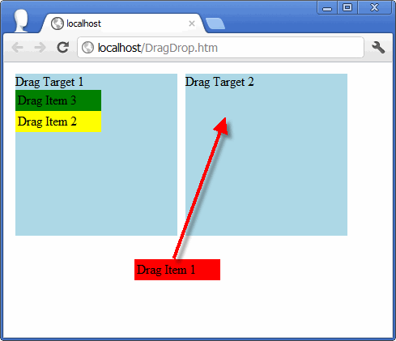

# JavaScript example of drag and drop to a target

Originally posted here:
https://www.codeproject.com/Articles/366432/JavaScript-example-of-drag-and-drop-to-a-target

This article explains how to make drag and drop to a target work across multiple browsers.

## Introduction

This article is a sequel to the article I wrote earlier: Cross-browser drag and drop. 
https://www.codeproject.com/Articles/226193/cross-browser-drag-and-drop

In that article, I provided a JavaScript example of drag and drop. Here I would like to provide a JavaScript example of drag and drop to a target that would work in all browsers (including Safari-iPad).

This article is for those that like nuts and bolts and are not using third party libraries like jQuery. There is nothing wrong with using third party libraries – I just like more flexibility. For those that like nuts and bolts I would recommend this third party library: Redips. https://www.redips.net/javascript/drag-and-drop-table-content/



## Using the code
To use this script, use the SetupDragDrop JavaScript function. It will make some DIVs dragable and other DIVs drag targets based on the CSS class (Dragable or DropTarget) used. Please note that this example shows how to “capture” the element so that you don’t lose it if you move outside of the element or outside of the browser window. 

I created two CSS classes to make drag-able elements not selectable and to have the cursor suggest that the element is drag-able.

```css
.Dragable{
    cursor:move;
   -moz-user-select: -moz-none;   
   -khtml-user-select: none;   
   -webkit-user-select: none;   
   -o-user-select: none;   
   user-select: none;
   width: 100px; 
   height:20px; 
   padding: 3px;
}

.DropTarget{
    width: 200px; 
    height:200px; 
    background-color: LightBlue;
    border: 3px solid white;
}
```
